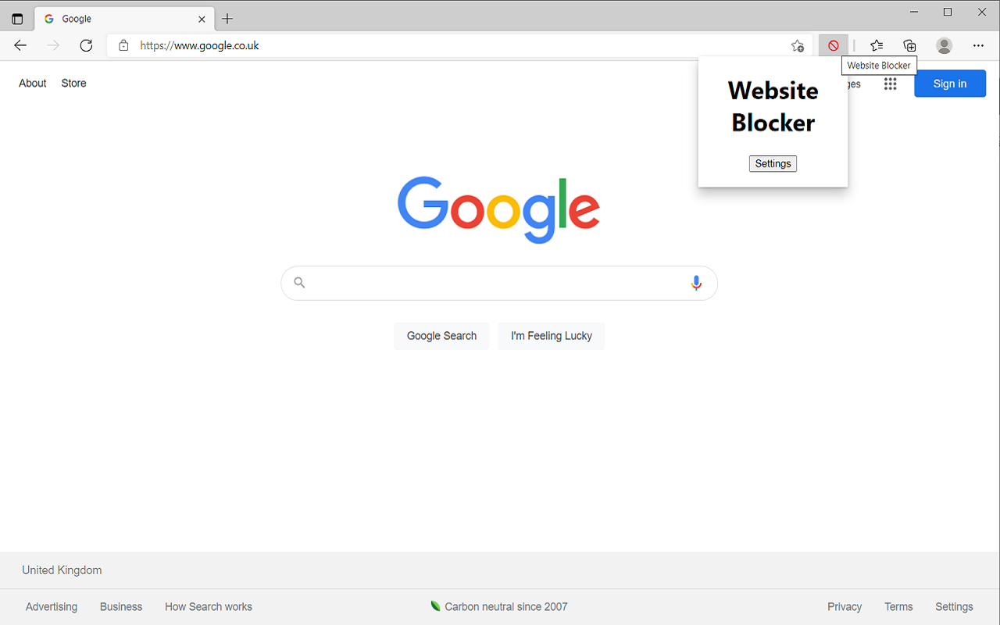
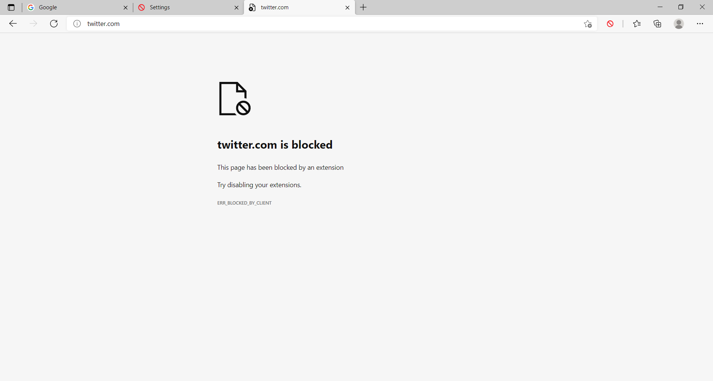

# Website Blocker

This Chrome extension allows you to create a list of websites that the browser is blocked from being able to visit. This can help you to avoid distracting websites and boost your productivity. The time that each website has been blocked for is also displayed. This feature motivates you to keep the website blocked as unblocking the website will reset the timer and it feels like you have lost your progress.

There are similar extensions on the Chrome Web Store, but a lot of them require the permission 'Read and change all your data on the websites your visit'. This permission is a bit alarming for obvious reasons. So I decided to implement my own extension which requires minimal permissions. The only permission this extension requires is 'Block content on any page you visit'.

## Technical Details

The extension uses Manifest V3. In order to block the websites, the chrome.declarativeNetRequest API is used. The popup and options pages are created using React. The following template was used for this extension: https://github.com/lxieyang/chrome-extension-boilerplate-react.

## Steps to run

- Run npm install to install the dependencies.
- Run npm start
- Load your extension on Chrome following:
  - Access chrome://extensions/
  - Check Developer mode
  - Click on Load unpacked extension
  - Select the build folder.

## Screenshots

