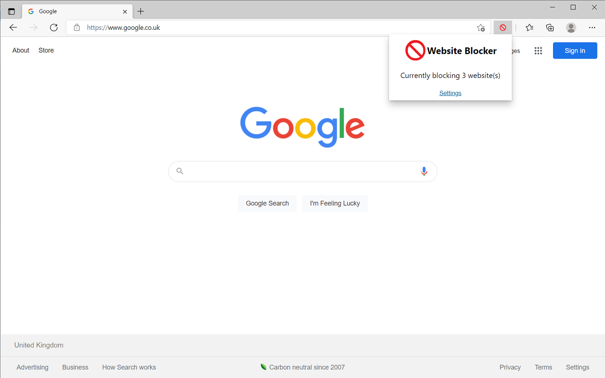

# Website Blocker

This Chrome extension allows you to create a list of websites that the browser is blocked from being able to visit. This helps you to avoid distractions and boost productivity. The time that each website has been blocked for is also displayed. This feature motivates you to keep the website blocked as unblocking the website will reset the timer and it feels like you have lost your progress.

This Chrome extension has been published in the Chrome Web Store.

## Technical Details

The extension uses Manifest V3. In order to block the websites, the chrome.declarativeNetRequest API is used. The popup and options pages are created using React. The following template was used for this extension: https://github.com/lxieyang/chrome-extension-boilerplate-react.

## Steps to run

- Run npm install to install the dependencies.
- Run npm start
- Load your extension on Chrome following:
  - Access chrome://extensions/
  - Check Developer mode
  - Click on Load unpacked extension
  - Select the build folder.

## Screenshots

