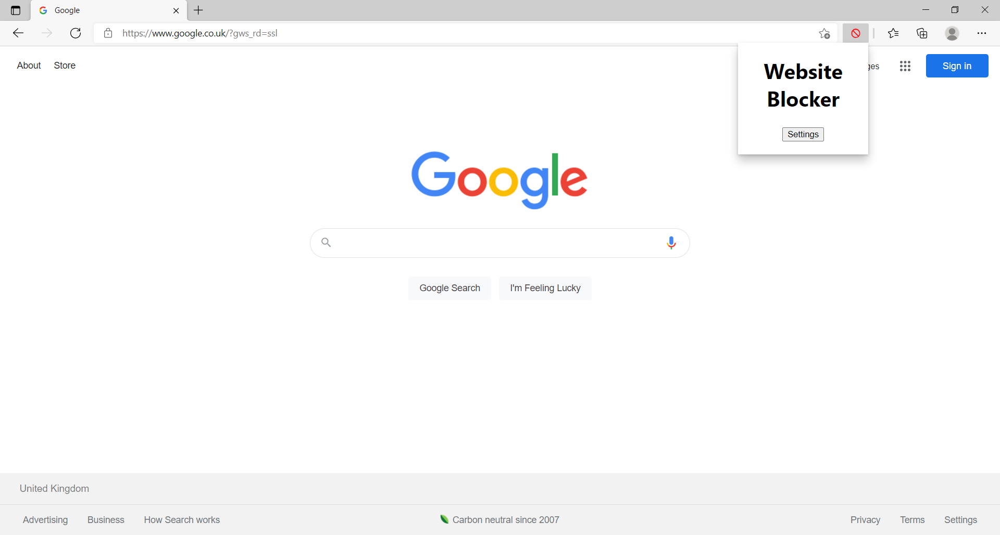
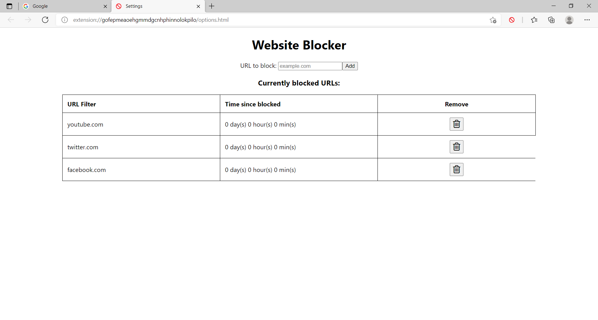

# Website Blocker

I created this Chrome extension because I regularly find myself getting distracted by social media websites. This extension allows you to create a list of blocked websites which the browser is blocked from visiting. There are similar extensions on the Chrome Web Store but I found that they weren't exactly what I wanted.

This Chrome extension was created using React with help from this template: https://github.com/lxieyang/chrome-extension-boilerplate-react.

## Steps to run

- Run npm install to install the dependencies.
- Run npm start
- Load your extension on Chrome following:
  - Access chrome://extensions/
  - Check Developer mode
  - Click on Load unpacked extension
  - Select the build folder.

## Images

