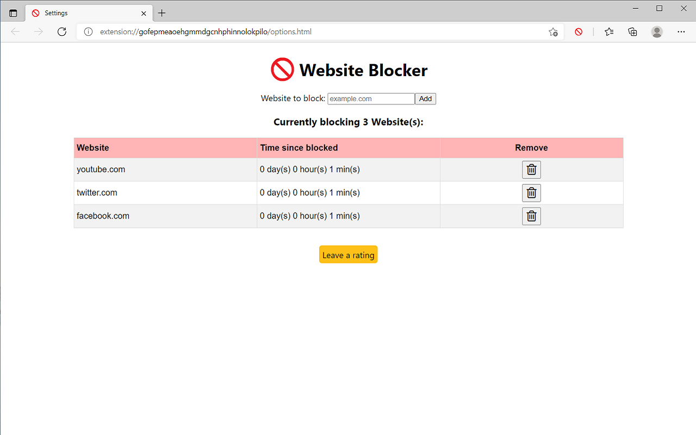

# Website Blocker

I created this Chrome extension because I regularly find myself getting distracted by social media websites. This extension allows you to create a list of blocked websites which the browser is blocked from visiting. The time that has passed since you blocked a specific website is also shown. This was added as an extra motivating factor to prevent you from just unblocking the website again. You can challenge yourself to see how long you can keep the site blocked for.

## Technical Details

The pages for this Chrome extension were created using React. The extension uses Manifest V3. The following template was used to create the extension: https://github.com/lxieyang/chrome-extension-boilerplate-react.

The only permission required for this extension is being able to 'Block content on any page you visit'. This is the very minimum of permissions needed for this extension to work. This extension has no additional site access.

## Steps to run

- Run npm install to install the dependencies.
- Run npm start
- Load your extension on Chrome following:
  - Access chrome://extensions/
  - Check Developer mode
  - Click on Load unpacked extension
  - Select the build folder.

## Screenshots

